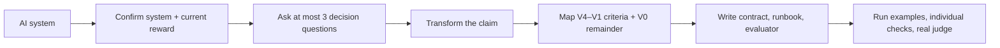

<h1 align="center">UVVR</h1>

<p align="center">
  <em>Turn “looks good” into an eval your agent can actually run.</em>
</p>

<p align="center">
  
  
  
  
</p>

---

UVVR turns a partly unverifiable AI workflow into this:

```text
evals/<system>/
├── README.md             # What the system does and why its reward is weak
├── design_contract.md    # Criteria, evidence, roles, blind spots
├── runbook.md            # How a coding agent collects complete run evidence
└── evaluate.py           # Deterministic checks + isolated semantic judges
```

The package is specific to your system. It knows which artifacts to collect,
which failures block, which qualities require a judge, and what remains owned by
a human.

UVVR does **not** make subjective judgment objectively true. It makes the
boundary between verified fact, grounded evidence, semantic proxy, and human
judgment explicit—and executable.

## The problem

Most AI eval requests begin like this:

> Is the research good? Is the product launch-ready? Is the design polished? Is
> the support reply helpful?

A single LLM score hides several different questions:

- Did the required action actually happen?
- Is there observable state or trace evidence?
- Does an independent reference support the claim?
- Is a model applying a subjective rubric?
- What can only a human or delayed outcome establish?

Treating all five as “judge score: 8/10” creates a reward that is easy to
optimize and hard to trust.

UVVR separates them.

## Before / after

Suppose a research agent claims:

> “This report is accurate, well sourced, complete, and useful.”

Before UVVR:

```text
LLM judge: 8.4 / 10
```

After UVVR:

| Criterion | Level | Role | What a pass establishes |
|---|---:|---|---|
| Citation syntax parses | V4 | `block` | References are structurally valid |
| Cited sources resolve | V3 | `block` | Sources existed and were retrievable |
| Material claims match evidence | V2 | `block` | Supplied evidence supports the claim |
| Source quality fits the claim | V1 | `score` | A calibrated rubric found the source appropriate |
| The report helps this user decide | V0 | human | The intended user found it useful |

The report can now fail for a concrete reason without pretending usefulness is a
machine-verifiable fact. See the complete [research-agent outcome
contract](examples/research-agent/outcome-contract.md).

## Verification strength

UVVR uses one level per criterion:

| Level | Evidence strength | Typical verifier |
|---|---|---|
| **V4** | Formal, deterministic, or executable | Parser, schema, tests, arithmetic, exact contract |
| **V3** | Grounded state, transition, or measured outcome | Browser state, database state, trace, transaction |
| **V2** | Independent anchor or provenance-bearing reference | Source evidence, known answer, curated reference set |
| **V1** | Structured semantic proxy | Rubric, learned verifier, model judge |
| **V0** | Unverifiable remainder | Human preference, expert dispute, delayed outcome |

The level does not decide the consequence. Every criterion separately receives
one role:

- `block` — sufficient failure evidence makes the result ineligible;
- `score` — partial credit or diagnosis;
- `audit` — monitored without deciding this run;
- `escalate` — requires a human or stronger process.

A V4 formatting check may only score. A V1 safety concern may escalate. Strength
and consequence are different axes.

## How it works



### 1. Understand the real system

UVVR inspects the repository, prompts, traces, tools, environment, and existing
evals. It describes the system in plain language:

```text
input → agent actions → output → current reward → downstream decision
```

You confirm that description before it designs anything.

### 2. Ask only decision-changing questions

UVVR asks at most three questions. It focuses on:

1. What decision should this eval make?
2. Which failure must block, and which alternatives remain valid?
3. Which evidence wins when specifications and observed behavior disagree?

Repository facts are discovered, not pushed back onto the user.

### 3. Transform the unverifiable claim

Open-ended work can become more evaluable through:

- executable end states;
- known-answer construction;
- round trips and metamorphic checks;
- temporal snapshots;
- differential comparison;
- provenance-bearing references;
- relative comparison against human-curated examples;
- delayed outcomes and explicit human review.

For subjective rewards, UVVR prefers relative comparison against curated anchors
over arbitrary absolute scores. The result is still a V1 judgment grounded by V2
evidence—not ground truth.

### 4. Generate an executable package

The generated `evaluate.py` contains:

- one function per V4/V3 criterion;
- isolated `codex exec` judging for V1 criteria;
- strict JSON input and output contracts;
- four public examples: known-good, plausible-bad, valid-alternative, reward-hack;
- no `no_decision` branch—missing evidence is an actionable evaluator error;
- explicit V0 human checklist.

The generated runbook must prove that its chosen system path exposes every
required artifact. It cannot claim screenshot evaluation when a wrapper strips
screenshots, or prescribe a runtime that cannot install the pinned dependencies.

## Evaluator interface

Every generated evaluator exposes the same operator surface:

```bash
# Public examples. No model spend.
python evaluate.py

# Evidence and human collection requirements.
python evaluate.py --checklist

# Every callable deterministic or judge criterion.
python evaluate.py --list-checks

# Debug one function using only its documented evidence.
python evaluate.py --check CHECK_NAME run.json

# Run the complete evaluation.
python evaluate.py run.json
```

Complete evaluations return:

```json
{
  "status": "success",
  "decision": "accept",
  "summary": "core flow passed and no criterion requires escalation",
  "criteria": {},
  "evidence": [],
  "human_checklist": [],
  "next_actions": [],
  "artifacts": []
}
```

Possible product decisions are `accept`, `reject`, and `escalate`. Missing input,
wrong-target evidence, unknown criteria, or judge failure returns evaluator
`error` with exact collection or retry steps—it is not silently converted into a
product failure.

## Install

### Codex

```bash
codex plugin marketplace add https://github.com/divo12/UVVR.git
codex plugin add uvvr@uvvr
```

Start a new thread, then ask:

```text
Design an executable eval for my AI system.
```

The same installation is available in the Codex desktop app after restart.

### Claude Code

In Claude Code, send these as two separate prompts:

```text
/plugin marketplace add divo12/UVVR
```

```text
/plugin install uvvr@uvvr
```

For local development:

```bash
git clone https://github.com/divo12/UVVR.git
claude --plugin-dir ./UVVR
```

### OpenCode

From a checkout, OpenCode discovers the included `/uvvr` command:

```bash
git clone https://github.com/divo12/UVVR.git
cd UVVR
opencode
```

```text
/uvvr describe the AI system you want to evaluate
```

### Cursor

The repository includes a description-selected Cursor rule at
[`.cursor/rules/uvvr.mdc`](.cursor/rules/uvvr.mdc). Open the checkout in Cursor
and ask it to design an eval; the rule routes back to the canonical UVVR skill.

## Why not just use an LLM judge?

LLM judges are useful. UVVR uses them for V1 criteria.

They become dangerous when they are asked to impersonate everything else:

- A judge should not infer database state when the database can be queried.
- A judge should not guess whether a browser action happened when a trace exists.
- A judge should not become “ground truth” because three models voted the same way.
- A judge should not turn missing evidence into a confident failure.

UVVR runs deterministic and grounded checks first. Semantic judges receive only
the evidence needed for their criterion, run in an isolated read-only process,
and return structured output. Judge failure is an evaluator error with a retry
path.

## Reward design for subjective work

For creative or design tasks, UVVR supports a taste-anchored reward stack:

1. Render the model output into an inspectable artifact.
2. Keep executable eligibility separate from aesthetic quality.
3. Prefer relative comparisons against several human-curated references.
4. Record pool provenance, coverage, sampling, and judge version.
5. Remove reward signals that are redundant or already saturated.
6. Keep reward improvements separate from prompt, tool, retry, and harness changes.

A V1 judge grounded by V2 references is stronger than an unanchored score. It is
still a proxy.

## What UVVR refuses to hide

- **Missing evidence.** The evaluator errors and tells you what to collect.
- **Valid alternatives.** Reference mismatch alone is not failure.
- **Reward hacks.** Glossy prose cannot overrule grounded failure evidence.
- **Judge uncertainty.** It escalates or errors; it does not average conflict away.
- **Human ownership.** V0 remains explicit instead of receiving a fake score.
- **Harness effects.** More retries or stronger tools are not mislabeled as model improvement.

## Repository layout

```text
UVVR/
├── .codex-plugin/              # Codex plugin manifest
├── .claude-plugin/             # Claude Code plugin + marketplace
├── .opencode/commands/         # OpenCode /uvvr adapter
├── .cursor/rules/              # Cursor UVVR rule
├── skills/uvvr/
│   ├── SKILL.md                # Runtime workflow source of truth
│   ├── assets/
│   │   └── design_contract.md  # Adapted into generated packages
│   └── references/
│       ├── evaluate.py         # Evaluator behavioral blueprint
│       └── runbook.md          # Evidence-collection authoring reference
├── examples/
│   └── research-agent/         # Concrete outcome-contract example
└── design/
    └── uvvr-core-contract.md   # Detailed design record
```

## Development

Validate the skill and plugin:

```bash
python3 ~/.codex/skills/.system/skill-creator/scripts/quick_validate.py skills/uvvr
python3 ~/.codex/skills/.system/plugin-creator/scripts/validate_plugin.py .
claude plugin validate .
```

Run the evaluator blueprint examples:

```bash
python3 -m py_compile skills/uvvr/references/evaluate.py
python3 skills/uvvr/references/evaluate.py
```

The expected decisions are:

```text
known-good        → accept
plausible-bad     → reject
valid-alternative → accept
reward-hack       → reject
```

When changing the evaluator or runbook references, regenerate an eval package in
a clean session and verify:

- every criterion appears in the contract, runbook, and evaluator;
- each deterministic check runs with only its own evidence;
- all long-running setup/run/judge commands are bounded and cleaned up;
- one real structured judge call succeeds;
- the full system path exposes every required artifact;
- fixture examples and private labels cannot contaminate real runs.

## Status and limitations

UVVR is alpha software (`0.1.0`). The plugin and reference evaluator validate,
but generated evals are only as faithful as their system instrumentation and
criteria.

UVVR does not:

- create universal ground truth for subjective work;
- replace domain experts or delayed outcome measurement;
- guarantee that one sampled run represents production behavior;
- provide a hosted evaluation service;
- collapse every criterion into one leaderboard score.

The project currently optimizes for inspectable local eval packages and honest
failure modes.

## FAQ

### Is a V1 judge ground truth?

No. It is a structured semantic proxy. If it uses an independent curated
reference set, that reference is V2 evidence; the judge remains V1.

### Why not return `no_decision` when evidence is missing?

Because the runbook must explain how to collect the required evidence. Until that
collection succeeds, the evaluator has an operational error—not a product
decision.

### Can UVVR evaluate creative work?

Yes, without claiming beauty is objectively correct. Use executable constraints,
human-curated anchors, relative judgment, valid-alternative tests, and an explicit
human remainder.

### Does UVVR run my production system automatically?

Not by default. It designs and validates the package. System execution happens
only when requested and only through the permissions and boundaries you provide.

## Design record

The core behavioral design is documented in
[design/uvvr-core-contract.md](design/uvvr-core-contract.md).

## Contributing

Useful contributions include:

- new system-specific eval packages with preserved raw evidence;
- verifier failure cases and reward hacks;
- improvements that make runbook inputs more collectable;
- cross-harness adapters that point to the canonical skill instead of copying it;
- independent tests of whether proxy gains transfer to original tasks.

Please keep unverifiable remainder visible. A contribution that makes the score
cleaner by hiding uncertainty is a regression.

## License

No license has been selected yet. The source is publicly visible, but reuse rights
are not granted until a `LICENSE` file is added. Choose a license explicitly before
calling the project open source or publishing a stable release.
